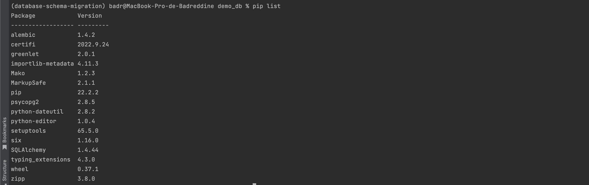
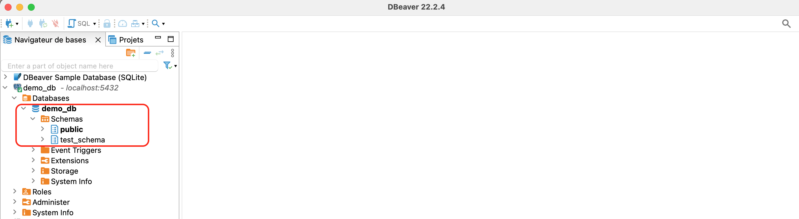
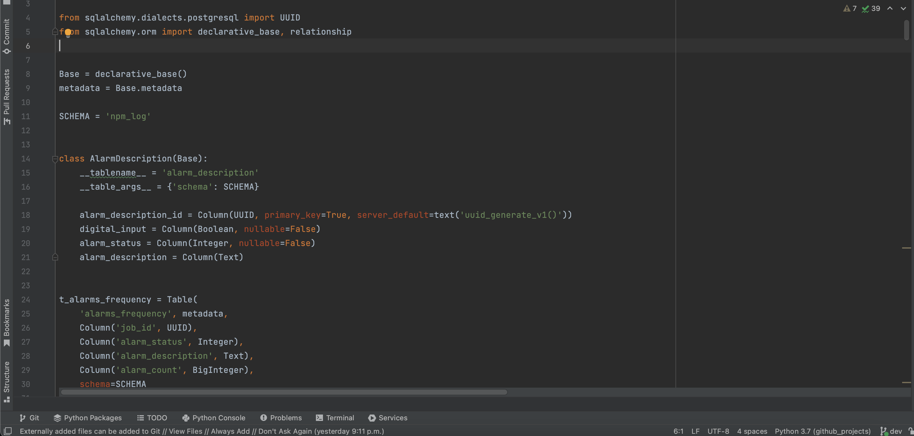
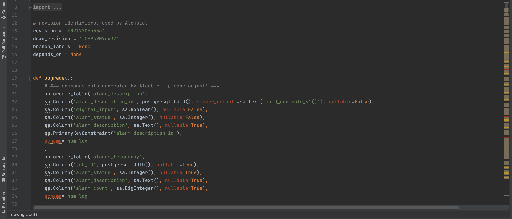
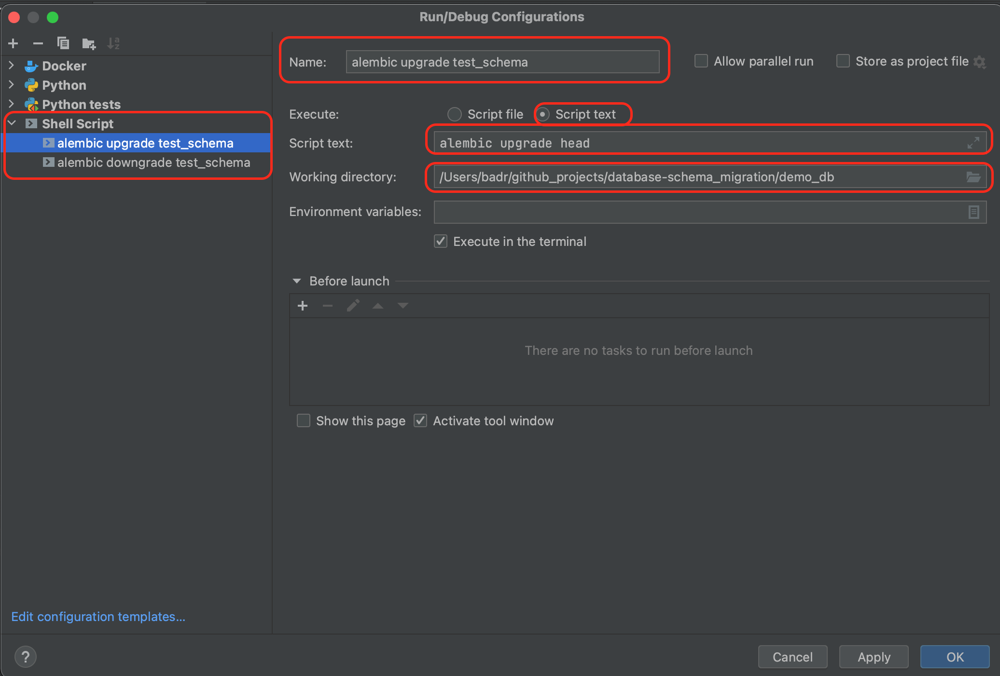
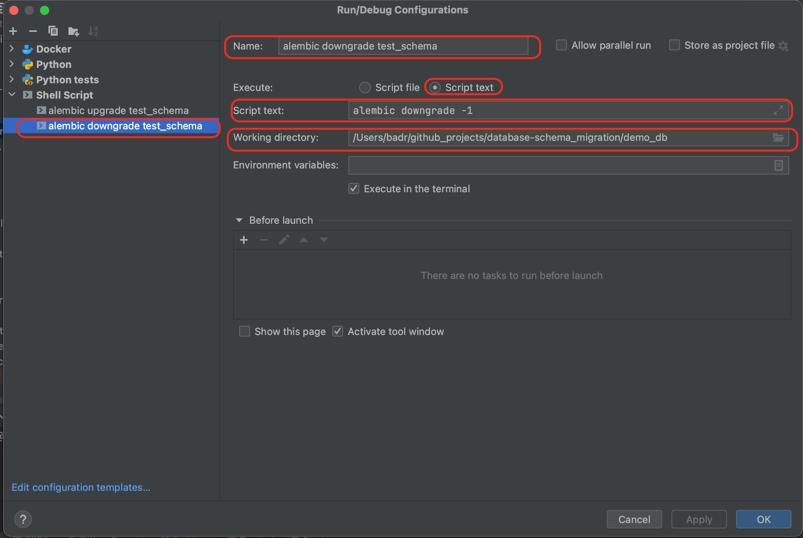

# alembic db migration
alembic db migration template

## Alembic utilities:
### Why alembic:

* Easier to maintain multiple database environments.
* Easier to set up local environment for developers.
* Easier to migrate schemas from one database to another
* No complex SQL statements
* Easily integrable with CI-CD
* No need to share credentials with developers

### What is alembic?

* Alembic is a lightweight database schema migration tool for usage with SQLAlchemy Database toolkit for python.
* Provides both upgrade and rollback functionality
* Easy to use python friendly way
* Alembic works by managing change management scripts by maintaining the ID of the last revision in the database.
### General directory structure
    database-schema-migration ---------> demo_db ---------> test_schema
                                                 ---------> test_schema_1
                              ---------> demo_1_db ---------> schema1
                                                   ---------> schema2


## Get started
### Create database migration project folder:
We create a folder, and we name it, for example: database-schema-migration

Open a terminal and _cd_ to the project directory then write:
```bash
  mkdir database-schema-migration
```
### Create two files:
* environment.yaml : this file will be used to create the virtual environment
* readme.md : this file will describe how and why to use this alembic.

### Create the virtual environment:
```bash
  cd database-schema-migration
  conda env create -f environment.yml 
  conda activate database-schema-migration
```

### Create a folder for each database and cd that folder, for example:
```bash
  mkdir demo_db
  cd demo_db
```
### init alembic
After cd the database folder, execute the ```init alembic``` for each database schema, for example:
```bash
  alembic init test_schema
```


After executing init command few files (alembic.ini) and folder (test_schema) are created inside the demo_db folder.
        
        demo_db/test_schema ...  done
        demo_db/test_schema/versions ...  done
        demo_db/test_schema/script.py.mako ...  done
        demo_db/test_schema/env.py ...  done
        demo_db/test_schema/README ...  done
        demo_db/alembic.ini ...  done

### Add db_base folder
Add ```db_bases``` folder. That folder has two main files: ```base.py``` and ```base_class.py```.
### Create database credentials file
Create ```demo_db_config.py``` file. That file will have the credentials to your database.
### modify file content
Modify the 'env.py':
* Add ```get_url``` function
* Modify ```run_migrations_offline``` by specifying:
``` python
    url=get_url(),
```
* Add the target metadata 
``` python
from base import DemoBase
target_metadata = DemoBase.metadata
```
To have the auto generated alembic script (alembic detects automatically the 
difference between the model of the schema and the database), we need to import 
the model and specify its metadata:
-----
env.py
``` python
currentdir = os.path.dirname(os.path.abspath(inspect.getfile(inspect.currentframe())))
currentdir = currentdir + '/db_bases'
sys.path.insert(0, currentdir)
from base import Base
target_metadata = Base.metadata
```

---
base.py
``` python
import sys
sys.path.insert(0, '/Users/badr/github_projects/common-codes')
from databases_util.databases_schema.db_dbname_schema import *  
```
---
Example of a model:


---
* modify ```run_migrations_online``` by specifying:

``` python
print(f'Starting online migration ...')
configuration = config.get_section(config.config_ini_section)
print(f'ini configuration {configuration}')
configuration["sqlalchemy.url"] = get_url()
print(f'After modification of ini configuration {configuration}')
connectable = engine_from_config(
       configuration,
       prefix="sqlalchemy.",
       poolclass=pool.NullPool,)
```


### create revision
If we want to create a revision without generating an automatic script:
```bash
  alembic revision -m "create test schema"
```
If we want to auto generate the alembic script, we execute the following command:
```bash
  alembic revision --autogenerate -m "baseline"
```
The ```--autogenerate``` option will generate the following script with the upgrade and downgrade functions. 
You need just to double-check the syntax and if there is something that is not detected automatically:




### Modify file content

Modify the file ```4cb84c335871_create_test_schema.py```: modify ```upgrade``` and ```downgrade``` by 
adding your SQL statement.

Before executing the following command, make sure you are 
located in the same directory as the ```alembic.ini``` file.
Check the alembic file content and make sure that the ```script_location```
is indicating the right position of your revision file.
### alembic upgrades
```sh
    alembic upgrade head --sql
or
    alembic upgrade head
```



### alembic downgrade
```sh
    alembic downgrade -1
```



## Create a local database from an existing schema
* First of all, you need to generate the model of the database using the ```sqlacodegen``` tool.
* Second, create an alembic database migration project.
* Third, create an empty schema using ```alembic revision -m 'create schema'```
* Forth, using the model specify target_metadata to the Base of you model after importing it for sure.
* Fifth, create a new revision using: ```alembic revision --autogenerate -m 'baseline'```
* Finally, execute ```alembic upgrade head``` then the tables and all the dependencies will be created.


Resources:
https://www.compose.com/articles/schema-migrations-with-alembic-python-and-postgresql/
https://medium.com/pythonistas/managing-multiple-databases-migrations-with-alembic-10025a4b3ab3